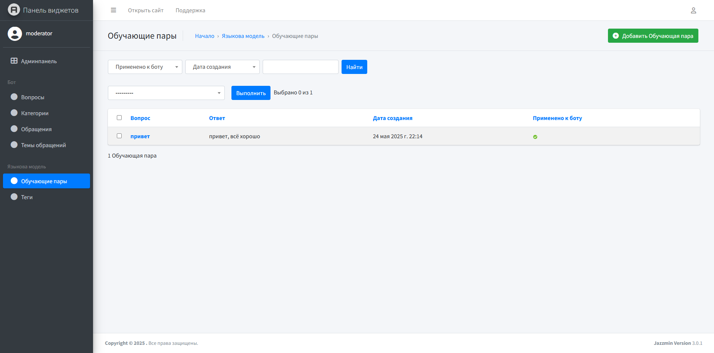

# Обучающие пары

Рассмотрим страницу администратора виджета "Обучающие пары".

<figure><figcaption>
Языковая модель -> обучающие пары
</figcaption></figure>

Данный раздел предназначен для формирования дополнительных фраз, на которые сможет отвечать виртуальный помощник.&#x20;

<kbd>**Обучение новым фразам**</kbd>

Добавление состоит из двух шагов:\
&#x20;      1\. Добавить обучающую пару (вопрос, ответ)\
&#x20;      2\. Выделить необходимые вопросы -> Дообучить бота на выбранных парах -> Выполнить

<figure><figcaption></figcaption></figure>

После успешного обучения, появится соответствующее сообщение.

<kbd>**Обучение на основе "Вопросов"**</kbd>

Виртуальный помощник требует обучения также после изменения вопросов, иначе он будет использовать старые вопросы для ответов. Подробнее как это сделать описано в разделе ["Вопросы"](rukovodstvo-polzovatelya/voprosy.md) данного руководства.
